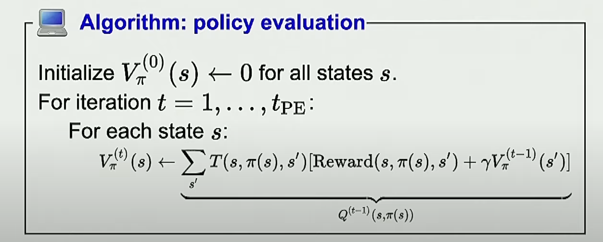
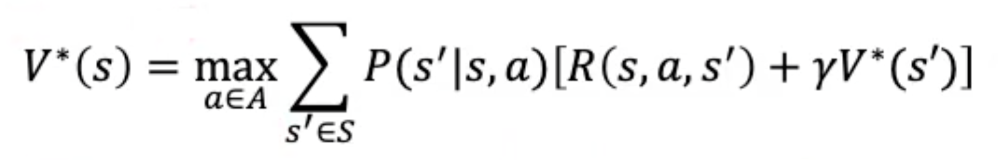
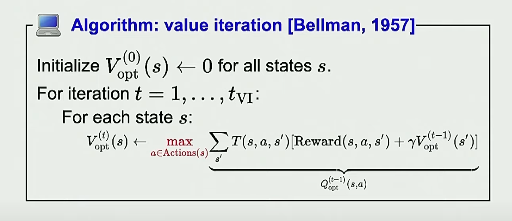

# MDP Solver
This program is an implementation of a generic mdp solver. 

### Input file
The input file can contain lines such as:
* Comment lines that start with # and are ignored

* Rewards/costs lines of the form 'name = value' where value is an integer 

* Edges of the form 'name : [e1, e2, e2]' where each e# is the name of an out 
edge from name 

* Probabilities of the form 'name % p1 p2 p3' where each p# is either the probability 
of success in a decision node or the probability of each edge in a chance node. 

### Output
The output of this program is the optimal policy for the given MDP and the values for each node.

## How to run
The program accepts the flags: `-df`, `-min`, `-tol`, and `-tier`. 
For information about each flag, use the `-h` flag. It will give the following output.
```
usage: mdp.py [-h] [-df [DF]] [-min] [-tol [TOL]] [-iter [ITER]] [-d] filename

Markov Process Solver: A generic markov process solver

positional arguments:
  filename      Input file

optional arguments:
  -h, --help    show this help message and exit
  -df [DF]      Discount factor [0, 1] to use on future rewards, defaults to 1.0
  -min          Minimize values as costs, defaults to False which maximizes values as rewards
  -tol [TOL]    Tolerance for exiting value iteration, defaults to 0.01
  -iter [ITER]  Integer that indicates a cutoff for value iteration, defaults to 100
  -d            Flag for debugging. It prints the attributes of the nodes before and after solving the MDP, defaults to False
```

### Example:
If we want to solve an MDP that's stored in a file called `test.txt` with a discount factor of 0.9 
and stopping the iterations at 150, then we want to call our MDP program in the following way.
```
python3 mdp.py -iter 150 -df 0.9 ./text.txt
```

## Program Specification
We use OOP to implement this program. To solve MDPs we use the following classes. 

### Policy
A policy π is a mapping from each state s ∈ States to an action a ∈ Actions(s). 
I think that in this assignment we are defining policy slightly different since 
I believe only decision nodes have actions and chance nodes do not. 

An optimal policy is a policy that yields the highest expected utility.

We have a class to represents policies. Each policy is a dictionary that represents a mapping between 
decision nodes and one of their children. In this class we also have a static method  to generate
random policies. 

### MDP
The MDP class contains everything required to solve the MDP such as value iteration and policy iteration. It also
contains functions to read files, and print the solutions to the terminal. 

### Nodes
Each node must have a reward/cost assigned to it. If there are nodes with no reward/cost 
assigned to them in the input file, then they will have a reward/cost of 0.

#### Decision Nodes
Decision nodes represent points where the decision maker has a choice of actions.

A decision Node is a node with a single probability. This probability indicates 
the success rate. The failure probability is distributed among the remaining edges. 
For example,
```
F : [C, E, G] 
F % .8
```
Given a policy of F -> E, transition probabilities would be {C=.1 E=.8 G=.1}, noting that 
this changes with the policy.

A node with edges but no probability entry is considered a decision node with probability 
of success equal to 1.

#### Chance Nodes
Chance nodes represent random variables. 

A node with `n` edges and `n` probabilities is considered a chance node. In other words, 
a node that has the same number of probabilities as edges is a chance node. For example,

```
A : [ B, C, D] 
A % 0.1 0.2 0.7
```
Indicates that from node A there is a 10% chance of transitioning to node B, 20% to node C 
and 70% to node D.

#### Terminal Nodes
A node with no edges is considered a terminal node.
If a terminal node has a probability assigned to it, the program will return an error. 

### Evaluating a Policy
We evaluate a policy by first calculating its utility. Utility is the sum of rewards 
along a path specified by the policy. Since a policy generates random paths, the utility 
is a random variable. 

The value of a policy is the expected utility. We define V<sub>π</sub>(s) as the expected 
utility from following the policy π from state s.

###Policy Evaluation Algorithm
We use `P(s′|s,a)` to denote the probability of reaching state s′ if action a 
is done in state s.

In each state s, the agent receives a reward R(s). 



## Value Iteration
In this program, the procedure ValueIteration computes a transition matrix using a fixed 
policy, then iterates by recomputing values for each node using the previous values 
until either:
* no value changes by more than the 'tol' flag,
* or -iter iterations have taken place.

The value iteration algorithm basically consists of this equation: 




# Using the MDP solver in python

**Example 1**: 
``` python
import pprint
from mdp import MDP

pp = pprint.PrettyPrinter(indent=4)

mdp1 = MDP(tolerance=0.001, max_iter=150)
mdp1.read_file("./tests/01_sample_input.txt")
mdp1.solve()
mdp1.print_solution()
pp.pprint(mdp1)
```


**Example 2**: 
``` python
mdp2 = MDP(df=0.9, tolerance=0.001, max_iter=150)
mdp1.read_file("./tests/02_sample_input.txt")
mdp2.solve()
mdp2.print_solution()
pp.pprint(mdp2)

```